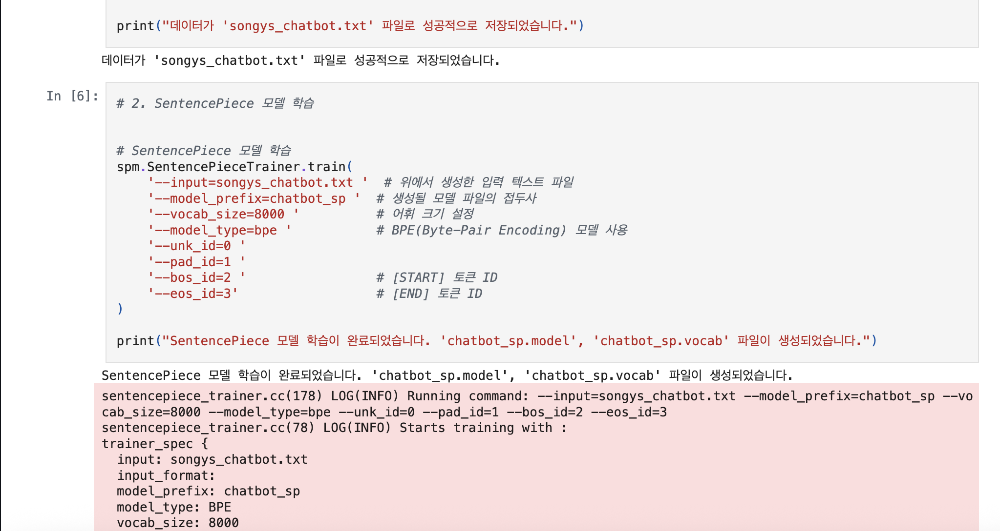
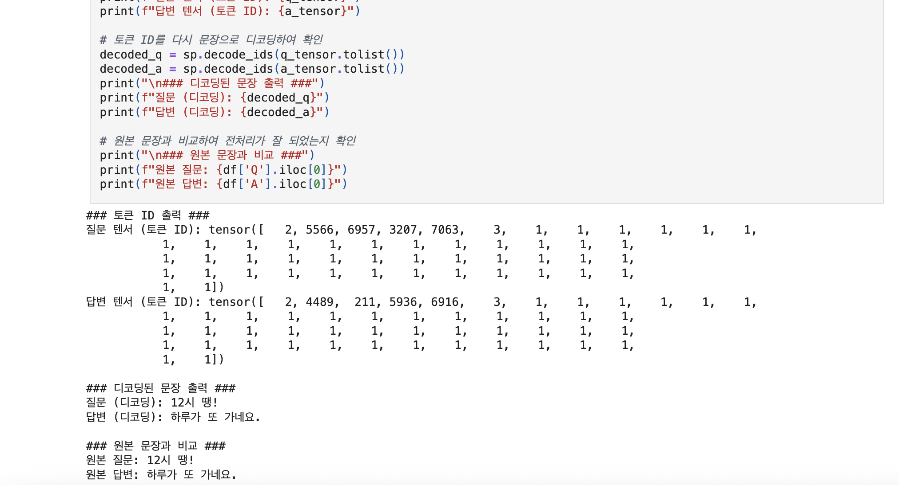
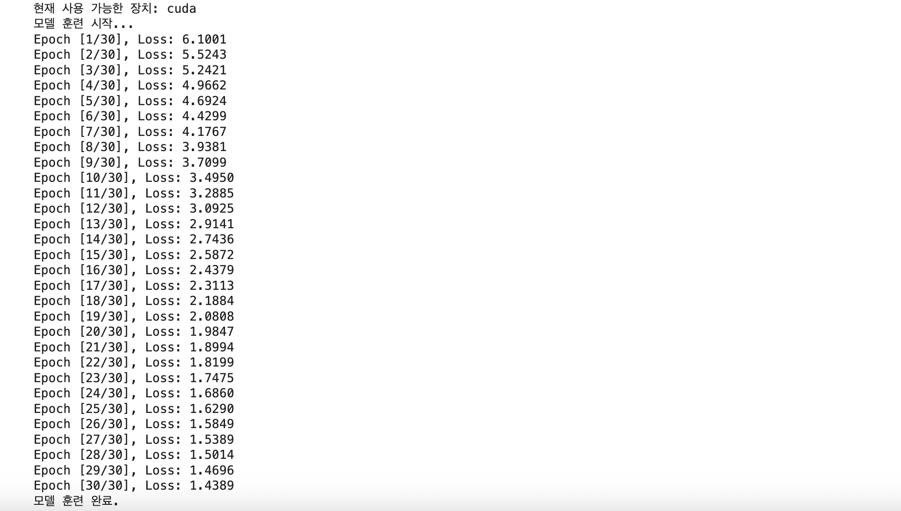
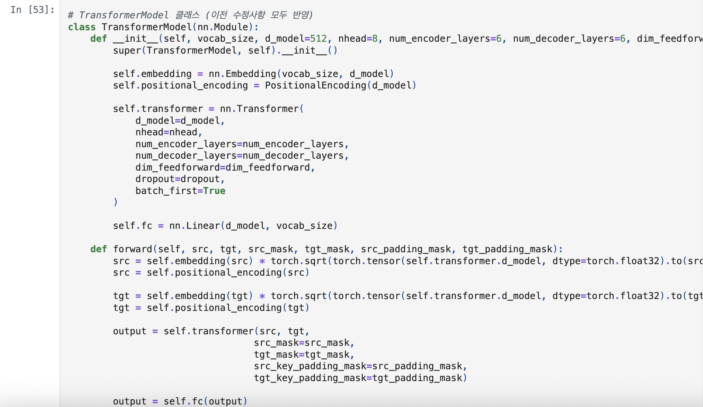
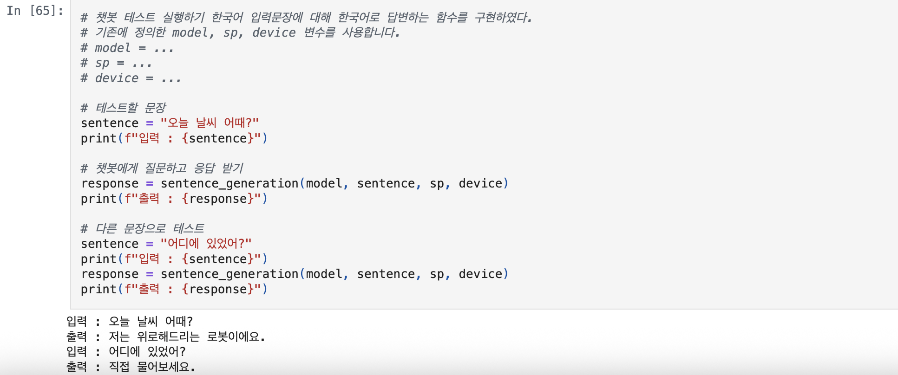

# AIFFEL Campus Online Code Peer Review Templete
- 코더 : 김찬웅
- 리뷰어 : 이규철


# PRT(Peer Review Template)
- [X]  **1. 주어진 문제를 해결하는 완성된 코드가 제출되었나요?**
    - 문제에서 요구하는 최종 결과물이 첨부되었는지 확인
        - 중요! 해당 조건을 만족하는 부분을 캡쳐해 근거로 첨부


문제에서 제시한 텍스트 전처리 이후 토크나이저 학습 이후 토크나이저를 활용해서
트랜스포머를 직접 정의해서 한국어 챗봇을 잘 만들어내셨습니다.
    
- [X]  **2. 전체 코드에서 가장 핵심적이거나 가장 복잡하고 이해하기 어려운 부분에 작성된 
주석 또는 doc string을 보고 해당 코드가 잘 이해되었나요?**
    - 해당 코드 블럭을 왜 핵심적이라고 생각하는지 확인
    - 해당 코드 블럭에 doc string/annotation이 달려 있는지 확인
    - 해당 코드의 기능, 존재 이유, 작동 원리 등을 기술했는지 확인
    - 주석을 보고 코드 이해가 잘 되었는지 확인
        - 중요! 잘 작성되었다고 생각되는 부분을 캡쳐해 근거로 첨부


트랜스포머 구조를 잘 구현해주셨습니다.
        
- [X]  **3. 에러가 난 부분을 디버깅하여 문제를 해결한 기록을 남겼거나
새로운 시도 또는 추가 실험을 수행해봤나요?**
    - 문제 원인 및 해결 과정을 잘 기록하였는지 확인
    - 프로젝트 평가 기준에 더해 추가적으로 수행한 나만의 시도, 
    실험이 기록되어 있는지 확인
        - 중요! 잘 작성되었다고 생각되는 부분을 캡쳐해 근거로 첨부

데이터를 전처리 하고 토큰화를 시킨 후 gpu에 올리지 않으셔서 생기셨던 문제점을 직접 잘 해결하셨습니다.
        
- [X]  **4. 회고를 잘 작성했나요?**
    - 주어진 문제를 해결하는 완성된 코드 내지 프로젝트 결과물에 대해
    배운점과 아쉬운점, 느낀점 등이 기록되어 있는지 확인
    - 전체 코드 실행 플로우를 그래프로 그려서 이해를 돕고 있는지 확인
        - 중요! 잘 작성되었다고 생각되는 부분을 캡쳐해 근거로 첨부

회고를 잘 작성하셨습니다. 대화에서 문답이 고정되지 않고 여러 문답이 생성되었습니다.
        
- [X]  **5. 코드가 간결하고 효율적인가요?**
    - 파이썬 스타일 가이드 (PEP8) 를 준수하였는지 확인
    - 코드 중복을 최소화하고 범용적으로 사용할 수 있도록 함수화/모듈화했는지 확인
        - 중요! 잘 작성되었다고 생각되는 부분을 캡쳐해 근거로 첨부

코드 중복을 최소화하고 함수화가 잘 되어있습니다.

# 회고(참고 링크 및 코드 개선)
```
데이터 전처리를 하는 과정부터 토크나이저를 통해 토큰화 시키고 트랜스포머를 정의하고 직접 한국어 챗봇 모델을 학습시켜서 활용한다는거가
쉬운 과제가 아니었습니다. 잘 수행하셨습니다. 
개인적인 회고는 지금은 단순하게 트레이닝 데이터를 학습시키고 이것의 생성 결과를 확인했는데, 다음 기회에는 트레인 발리데이션 테스트 데이터로 나눠서
챗봇의 텍스트 생성 성능을 확인할 수 있는 메트릭을 활용해 직접 평가를 해보고싶습니다. 정말 고생 많으셨습니다.

# 리뷰어의 회고를 작성합니다.
# 코드 리뷰 시 참고한 링크가 있다면 링크와 간략한 설명을 첨부합니다.
# 코드 리뷰를 통해 개선한 코드가 있다면 코드와 간략한 설명을 첨부합니다.
```
